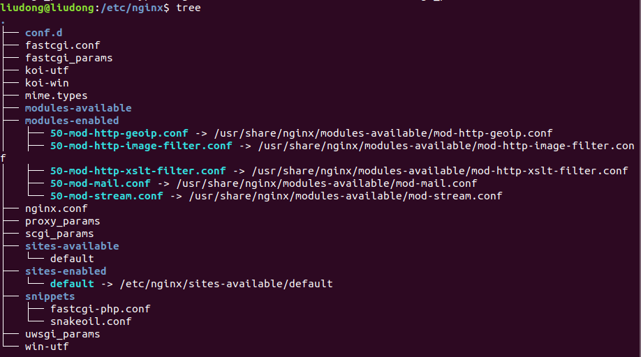

>  2020年3月2日,在家做论文实验无果,想着自己有一台云服务器和几个域名,便想搭建一个在线的个人博客.
>
>  这篇文章记录了我搭建个人博客所踩的坑,一切都来之不易啊~

## 云服务器配置

1. 安装一个nginx
2. 安装一个git
3. 其他: 允许端口访问之类的配置

### 安装&配置nginx

1. 直接使用apt来安装nginx,安装好之后,nginx的默认配置目录是 \etc\nginx

```bash
apt install nginx
```

2. nginx配置目录,我们需要关注的两个文件是:

   - nginx.conf(暂时可以不关注这个文件,后面坑位会简单说一说)

   - sites-enabled文件夹下的default配置文件,重点关注server中的配置,下面展示了配置文件前面几行的部分内容

     ```
     server {
             listen 80 default_server;
             listen [::]:80 default_server;
             root /home/liudong/桌面/写作空间/myblog;  # 这里需要改动为自己博客存放的根目录,其他不变
             index index.html index.htm index.nginx-debian.html;
     
             server_name _;
     
             location / {
                     # First attempt to serve request as file, then
                     # as directory, then fall back to displaying a 404.
                     try_files $uri $uri/ =404;
             }
     ```
   

   


### Git配置

1. 使用 ```apt install git```命令安装一个git

2. 定义```hooks```,以便让接收到文件之后执行简单的命令

   - 创建一个接受源文件的git仓库目录, ```mkdir myblogGit```

   - 进入仓库,并初始化

     ```bash
     cd myblogGit
     git init --bare myblog.git  # 此处的 myblog 可以替换为任何名字
     ```

     执行了初始化命令之后,会生成一个myblog.git文件夹,同时下面有hooks文件夹

   - 在hoosk文件夹新建并编辑一个文本文件

     ```
     cd myblog.git/hooks
     vi post-receive
     ```

     然后在文件post-receive中输入下述的定义, --work-tree对应的是nginx中root指定的博客目录, --git-dir指定的是我在云服务器上创建的git仓库

     ```
     #!/bin/bash
     git --work-tree=/home/liudong/桌面/写作空间/myblog --git-dir=/文件路径/myblogGit/myblog.git checkout -f
     ```


## 本地电脑配置

1. 安装一个hexo,详见 [hexo官方文档](https://hexo.io/)

2. 配置hexo的```_config.yml```文件,下述代码是该配置文件末尾的内容

   ```
   deploy:
     type: git
     repo: 云服务器的用户名@云服务器的ip地址:/文件路径/myblogGit/myblog.git
     branch: master
   ```

   如上所示,主要的就是repo设置!

3. 发布文章&推送到云服务器上

   - 常见的hexo命令
- 使用```hexo d```命令发布文章到云服务器(别慌,你很可能会失败,失败原因见下一个版块)
   
   ```
   hexo new "一片文章的名字"
   hexo g # 根据文章生成网页内容
   hexo s # 开启本地服务器,在本地预览
   hexo d # 发布到我们在deploy中配置的服务器上
```

## 专属坑位

### 本地hexo发布出现问题

原因是因为缺少一个插件,执行```npm install -save hexo-deployer-git```安装即可

### nginx在配置文件中定义root为博客文件存放的目录却一直返回404

不得不说,这是一个巨坑,我首先确定了文件目录以及文件都是任何用户可读的,纠结了一段时间之后,还是通过google搜到了[一篇经验](https://www.jianshu.com/p/c70b24c28ff3).


 nginx默认用户是nobody,没有访问用户目录的权限,因此要修改nginx.conf文件中的第一行.

```user root root;```**第一个root表示用户,第二个用户表示用户组别**


## 参考

- [hexo+nginx搭建个人博客](https://zhuanlan.zhihu.com/p/68916423)
- [利用云服务器搭建个人博客](https://www.jianshu.com/p/ad71f7a531a5)
- [Nginx配置图片服务器](https://www.jianshu.com/p/c70b24c28ff3)

---

此时是23:17, 我的记录就到此结束了,今天又是忙碌的一天!